# Olist E-Commerce Business Intelligence & Analytics

> An end-to-end Business Intelligence and Data Analytics project built using real-world Brazilian e-commerce data from Olist.

[](https://www.python.org/)
[](https://pandas.pydata.org/)
[](https://numpy.org/)
[](https://www.sqlite.org/)
[](https://www.sqlite.org/)
[](https://streamlit.io/)
[](https://plotly.com/)
[](https://scikit-learn.org/)
[](https://jupyter.org/)
[](https://git-scm.com/)
[](https://github.com/)

---

## Table of Contents

- [About the Project](#about-the-project)
- [Business Problem](#business-problem)
- [Key Objectives](#key-objectives)
- [Business Questions](#business-questions)
- [Key Features](#key-features)
- [Technology Stack](#technology-stack)
- [Project Workflow](#project-workflow)
- [Dataset](#dataset)
- [Data Cleaning and Validation](#data-cleaning-and-validation)
- [Exploratory Data Analysis](#exploratory-data-analysis)
- [Advanced Analytics](#advanced-analytics)
- [SQL Analytics and Database](#sql-analytics-and-database)
- [Automated KPI Reporting](#automated-kpi-reporting)
- [Streamlit Dashboard](#streamlit-dashboard)
- [Dashboard Screenshots](#dashboard-screenshots)
- [Verified Business Metrics](#verified-business-metrics)
- [Project Structure](#project-structure)
- [Installation](#installation)
- [How to Run](#how-to-run)
- [Documentation](#documentation)
- [Future Enhancements](#future-enhancements)
- [Project Status](#project-status)
- [Author](#author)
- [License](#license)

---

## About the Project

**Olist E-Commerce Business Intelligence & Analytics** is an end-to-end
Data Analytics and Business Intelligence project built using the
**Brazilian E-Commerce Public Dataset by Olist**.

The project analyzes real marketplace data across orders, customers,
products, sellers, payments, reviews, delivery, and geography.

The workflow transforms raw transactional data into cleaned datasets,
business analysis, advanced analytics, SQL analytics, automated KPIs,
and an interactive Streamlit dashboard.

The project demonstrates practical skills in:

- Data Analysis
- Business Intelligence
- Python
- SQL
- Data Visualization
- Customer Analytics
- Business Reporting
- Dashboard Development

---

## Business Problem

E-commerce businesses generate data across multiple business functions.

Orders, customers, products, sellers, payments, reviews, delivery, and
geographic datasets provide different views of marketplace activity.

Analyzing these datasets separately can make it difficult to understand
overall business performance.

This project brings these areas together to analyze:

- Revenue and order performance
- Customer purchasing behavior
- Product and category performance
- Seller performance
- Delivery operations
- Customer reviews
- Geographic activity
- Business KPIs

The objective is to convert transactional data into structured and
business-focused insights.

---

## Key Objectives

- Analyze real-world e-commerce data
- Audit source datasets
- Identify data quality issues
- Clean and prepare analytical data
- Validate dataset relationships
- Perform Exploratory Data Analysis
- Analyze customers, products, and sellers
- Analyze delivery and review performance
- Build customer segmentation
- Perform cohort and growth analysis
- Build seller intelligence
- Create SQL-based business analytics
- Build an analytical SQLite database
- Generate automated KPIs and insights
- Develop an interactive Streamlit dashboard
- Present findings through business visualizations
---

## Business Questions

The project answers practical business questions across sales, customers,
products, sellers, operations, reviews, and geography.

### Sales and Revenue

- What is the overall order and revenue performance?
- How does revenue change over time?
- What is the Average Order Value?
- Which months show higher revenue activity?

### Customers

- How many customers placed orders?
- How many customers made repeat purchases?
- What customer segments can be identified?
- How does customer retention vary across cohorts?

### Products and Categories

- Which categories generate the most revenue?
- Which categories have the highest order activity?
- Which products contribute significantly to sales?

### Sellers

- How does seller performance vary?
- Which sellers generate high revenue?
- Which sellers show delivery or satisfaction problems?

### Operations

- What is the average delivery time?
- How many orders were delayed?
- How does delivery performance vary by state?

### Reviews and Geography

- How are customer review scores distributed?
- What patterns can be observed in customer satisfaction?
- Which states contribute significantly to marketplace activity?

### Reporting

- Which KPIs should management monitor regularly?
- Which business trends should be highlighted?

---

## Key Features

### Data Analytics

- Dataset profiling
- Data quality analysis
- Missing-value analysis
- Duplicate checks
- Datatype validation
- Relationship validation
- Data cleaning
- Exploratory Data Analysis

### Business Intelligence

- Revenue analysis
- Order analysis
- Customer analysis
- Product and category analysis
- Seller performance analysis
- Delivery analysis
- Customer review analysis
- Payment analysis
- Geographic analysis

### Advanced Analytics

- RFM customer segmentation
- Repeat customer analysis
- Cohort analysis
- Customer retention analysis
- Seller intelligence
- Growth analytics
- Business opportunity analysis

### SQL and Database

- SQLite analytical database
- Dimension and fact tables
- Revenue reconciliation
- Data integrity validation
- 18 analytical SQL queries

### Automated Reporting

- Executive KPI summary
- Monthly performance
- Category performance
- State performance
- Payment analysis
- Automated business insights
- Markdown KPI report

### Dashboard

- Interactive Streamlit dashboard
- Nine analytical pages
- Global filters
- KPI cards
- Interactive charts
- Analytical tables
- Customer intelligence
- Seller intelligence
- Delivery analytics
- Geographic analytics
- Advanced analytics

---

## Technology Stack

| Category | Technologies |
|---|---|
| Programming | Python |
| Data Analysis | Pandas, NumPy |
| Visualization | Plotly, Matplotlib |
| Machine Learning | Scikit-learn |
| Database | SQLite |
| Query Language | SQL |
| Dashboard | Streamlit |
| Notebook | Jupyter Notebook |
| Development | VS Code |
| Version Control | Git, GitHub |
| Dataset | Olist Brazilian E-Commerce Dataset |

---
## Project Workflow

The project follows an end-to-end Business Intelligence workflow from
raw Olist data to an interactive analytical dashboard.

```text
Real Olist Dataset
        |
        v
Phase 1 - Dataset Audit
        |
        v
Phase 2 - Data Cleaning and Preparation
        |
        v
Phase 3 - Exploratory Data Analysis
        |
        v
Phase 4 - Streamlit Dashboard
        |
        v
Phase 5 - Advanced Analytics
        |
        v
Phase 6 - SQL Analytics and Database
        |
        v
Phase 7 - Automated KPI Reporting
        |
        v
Phase 8 - Dashboard Integration
        |
        v
Business Intelligence Dashboard
```

## Exploratory Data Analysis

The Exploratory Data Analysis phase examines the major business dimensions
of the Olist marketplace.

### Sales and Revenue Analysis

- Order volume over time
- Monthly revenue trends
- Average Order Value
- Revenue distribution
- Delivered-order performance

### Customer Analysis

- Customer order activity
- Customer purchasing behavior
- Repeat customer analysis
- Customer distribution by state

### Product and Category Analysis

- Category-level order activity
- Category revenue contribution
- Product-level sales analysis
- Category performance trends

### Seller Analysis

- Seller revenue performance
- Seller order activity
- Seller review performance
- Seller delivery performance

### Delivery Analysis

- Average delivery time
- Estimated versus actual delivery
- Delayed-order analysis
- Delivery performance by state

### Review Analysis

- Review-score distribution
- Customer satisfaction patterns
- Review-based business analysis

### Geographic Analysis

- Customer distribution by state
- Seller distribution by state
- Marketplace activity across geographic regions

EDA outputs and visualizations are generated from the cleaned Olist data.

---

## Advanced Analytics

The project extends traditional descriptive analytics with customer,
seller, retention, and growth-focused analysis.

### RFM Customer Segmentation

Customers are analyzed using:

- Recency
- Frequency
- Monetary value

The resulting segments help understand differences in customer purchasing
behavior.

### Repeat Customer Analysis

The project identifies customers with multiple delivered orders and
calculates repeat-customer metrics.

### Cohort Analysis

Customers are grouped by their first purchase period to analyze purchasing
behavior across subsequent periods.

### Customer Retention

Cohort-based analysis is used to study customer activity over time.

### Seller Intelligence

Seller-level analytics examine:

- Revenue
- Order volume
- Review performance
- Delivery performance
- Seller-level business patterns

### Growth Analytics

Growth analysis examines:

- Monthly order trends
- Monthly revenue trends
- Category performance
- State-level performance
- Business opportunities

---

## SQL Analytics and Database

The project uses **SQLite** to create a structured analytical database.

### Database Layers

The database contains:

- Source tables
- Dimension tables
- Fact tables

### Important Tables

```text
Source / Clean Tables
    |
    +-- customers
    +-- orders
    +-- order_items
    +-- order_payments
    +-- order_reviews
    +-- products
    +-- sellers
    +-- geolocation
    +-- category_translation

Dimension Tables
    |
    +-- dim_customer
    +-- dim_product
    +-- dim_seller
    +-- dim_date
    +-- dim_geography

Fact Tables
    |
    +-- fact_orders
    +-- fact_sales
```


## Automated KPI Reporting

The project includes an automated KPI and business reporting layer.

### KPI Outputs

The reporting pipeline generates:

- Executive KPI summary
- Monthly performance
- Category performance
- State performance
- Payment analysis
- Business insights
- Markdown business report

### KPI Engine

The KPI generation is handled through:

```text
src/phase7_kpi_engine.py
```

## Dashboard Screenshots

The following screenshots show the actual Streamlit dashboard and its
analytical pages.

### Executive Overview

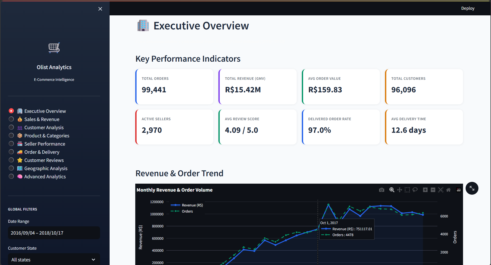

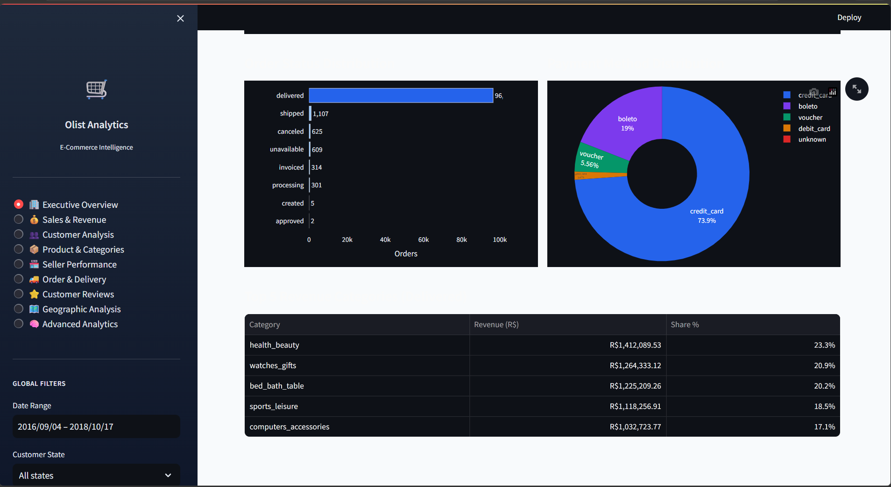


### Sales & Revenue

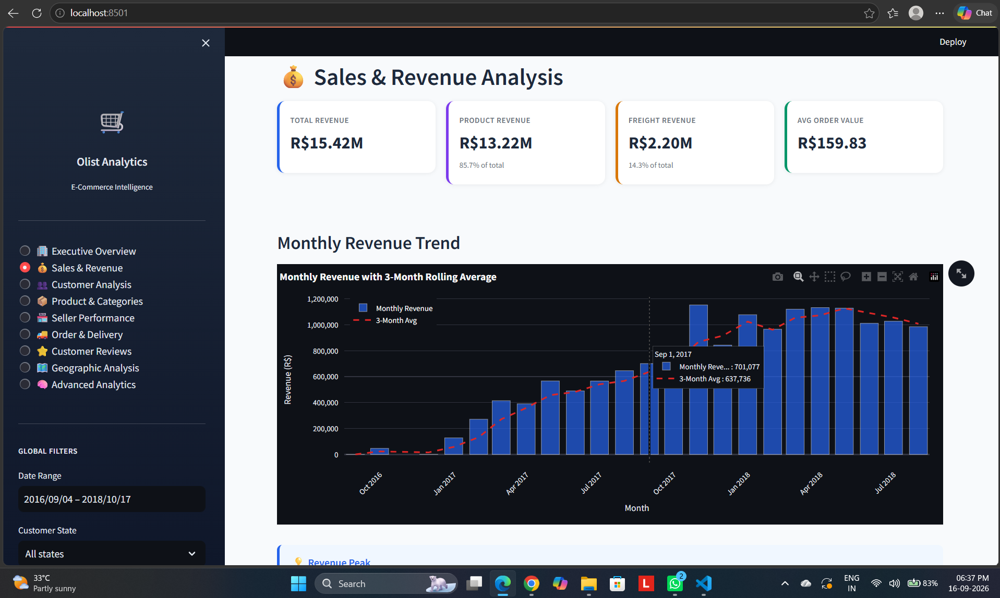

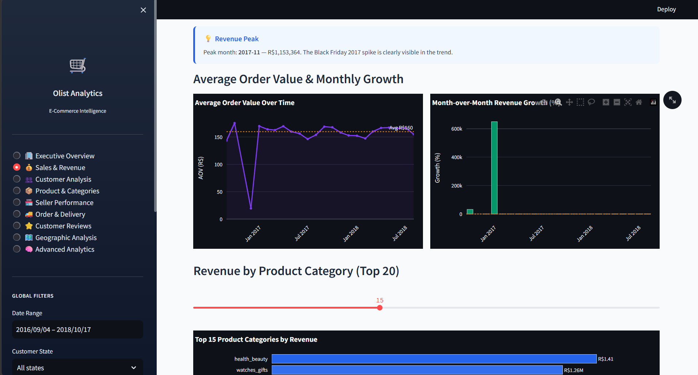


### Customer Analysis

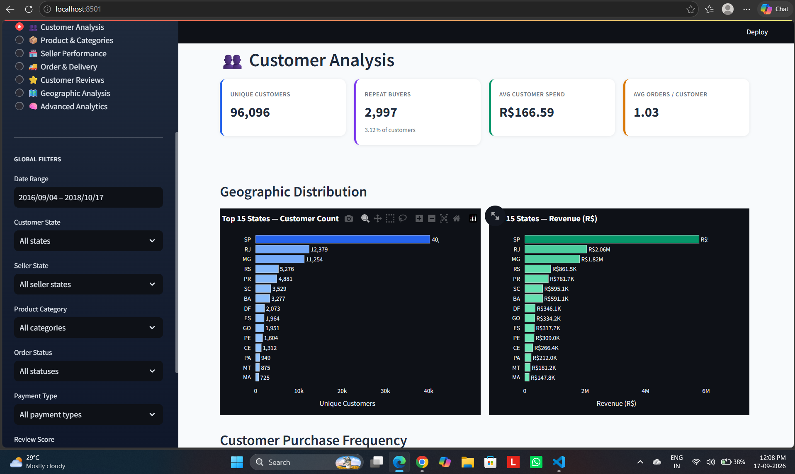

### Product & Categories

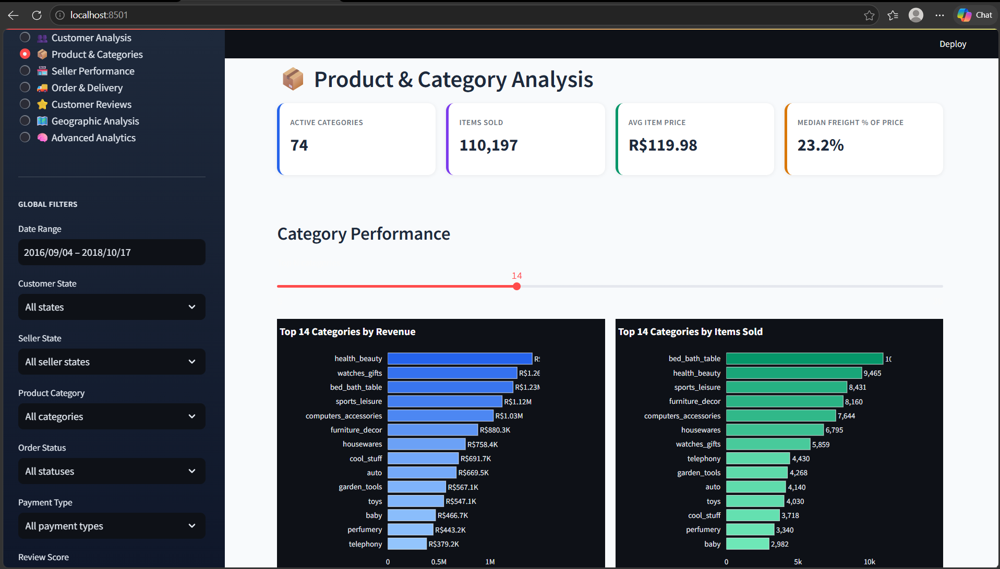


### Seller Performance

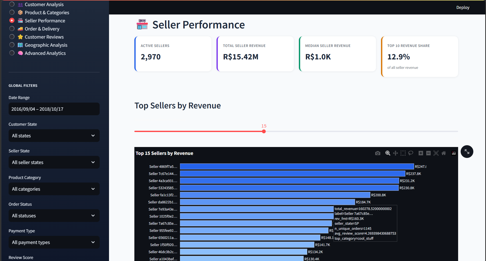


### Order & Delivery


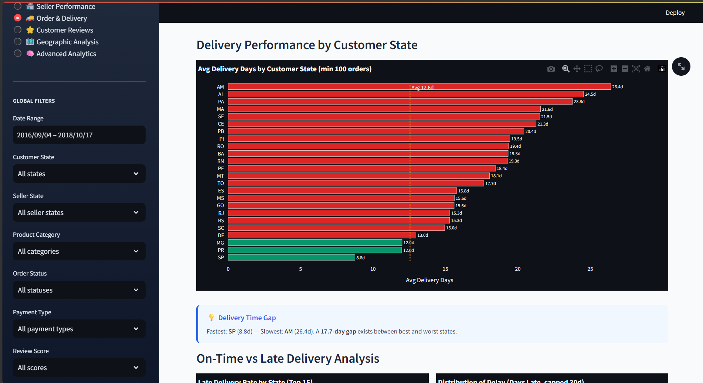

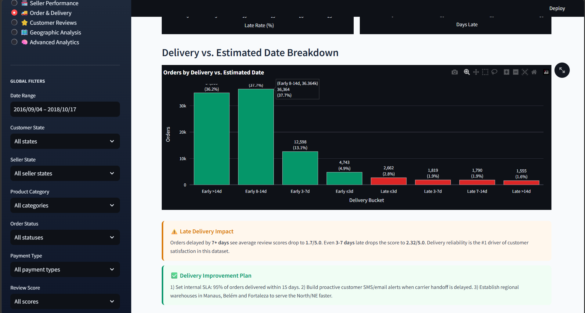

### Customer Reviews

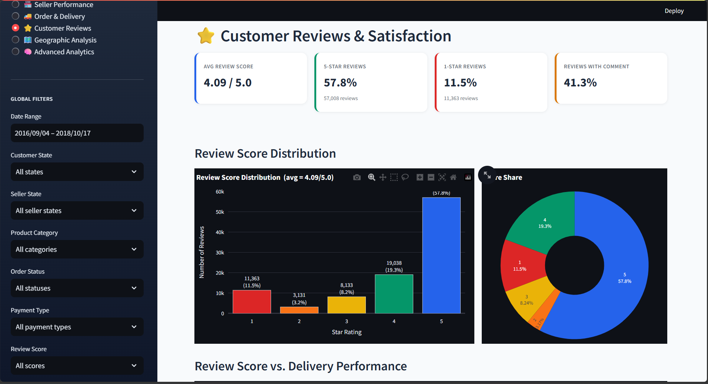

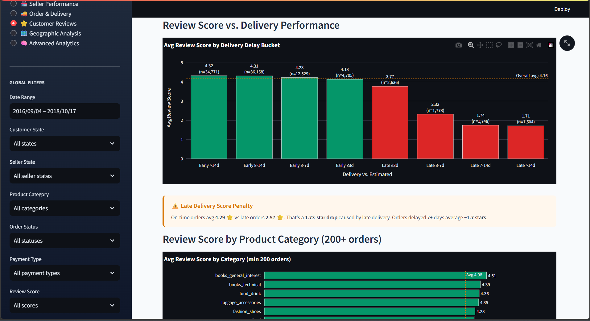


### Geographic Analysis


### Advanced Analytics

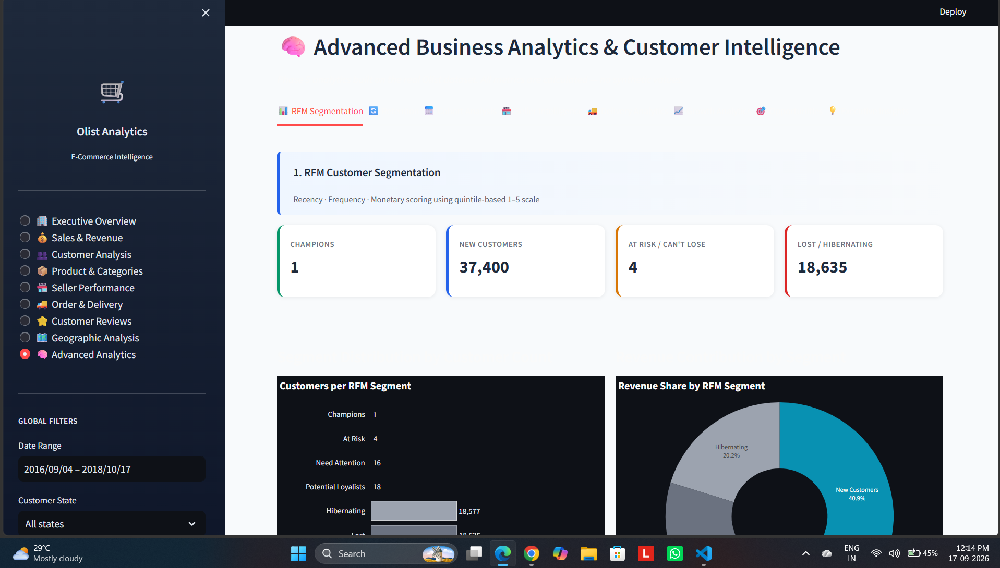

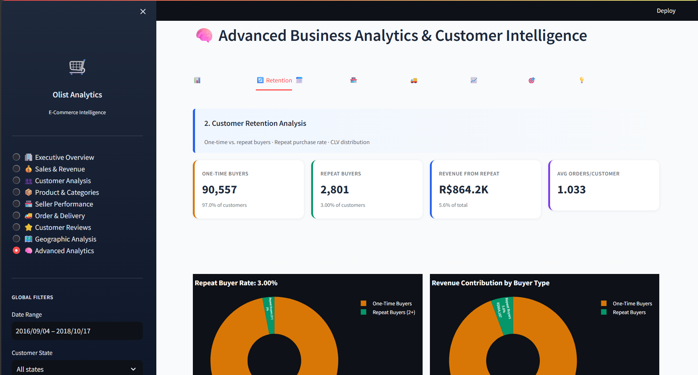

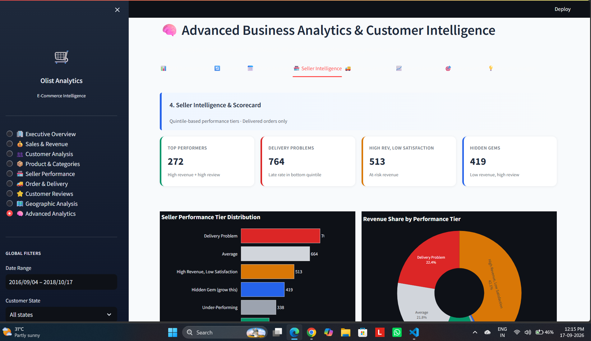


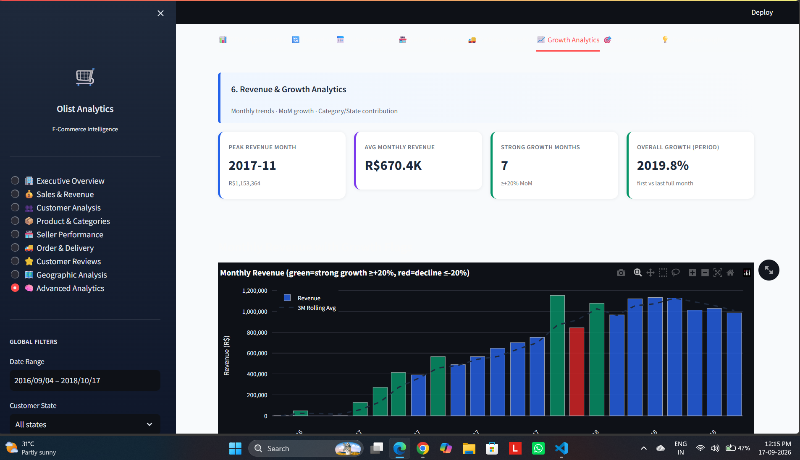

---
## Verified Business Metrics

The following metrics were verified using the project's analytical
database and validation workflow.

| Metric | Verified Value |
|---|---:|
| Total Orders | 99,441 |
| Delivered Orders | 96,478 |
| Total Revenue | R$15,419,773.75 |
| Average Order Value | R$159.83 |
| Average Delivery Time | 12.56 days |
| Delayed Orders | 7,826 |
| Delayed Order Rate | 8.11% |
| Customer Analytics Population | 93,358 |
| Repeat Customers | 2,801 |
| Repeat Customer Rate | 3.00% |
| Sellers | 3,095 |
| Products | 32,951 |
| Order Items | 112,650 |
| Reviews | 98,673 |
| SQL Analytical Queries | 18 |
| Database Tables | 17 |
| Validation Checks Passed | 54 |
| Validation Checks Failed | 0 |

### Revenue Reconciliation

```text
fact_orders revenue = R$15,419,773.75
fact_sales revenue  = R$15,419,773.75
difference           = R$0.00


