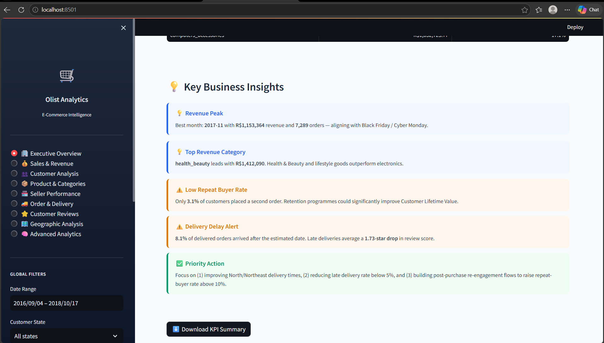
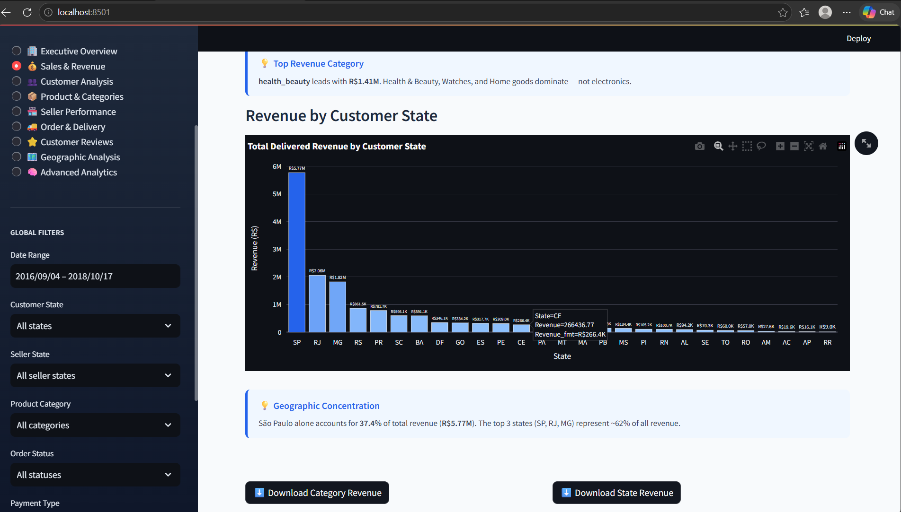
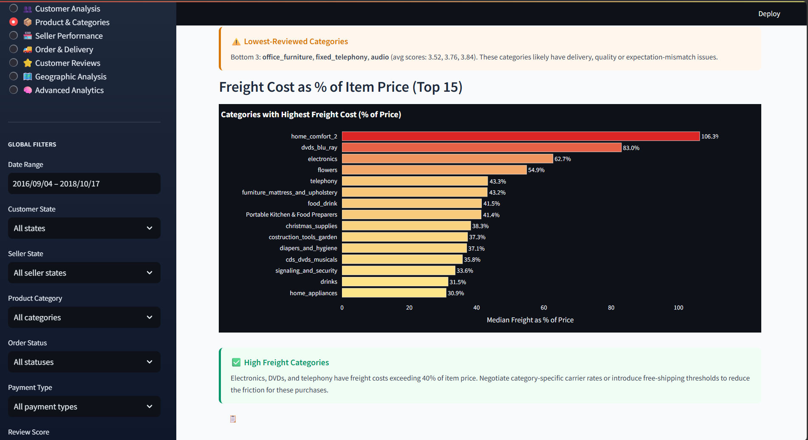
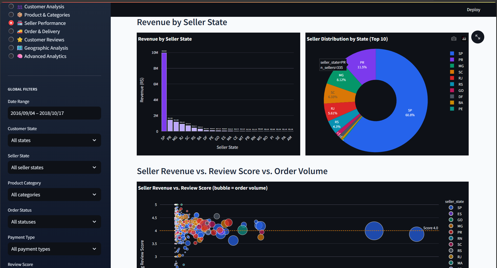
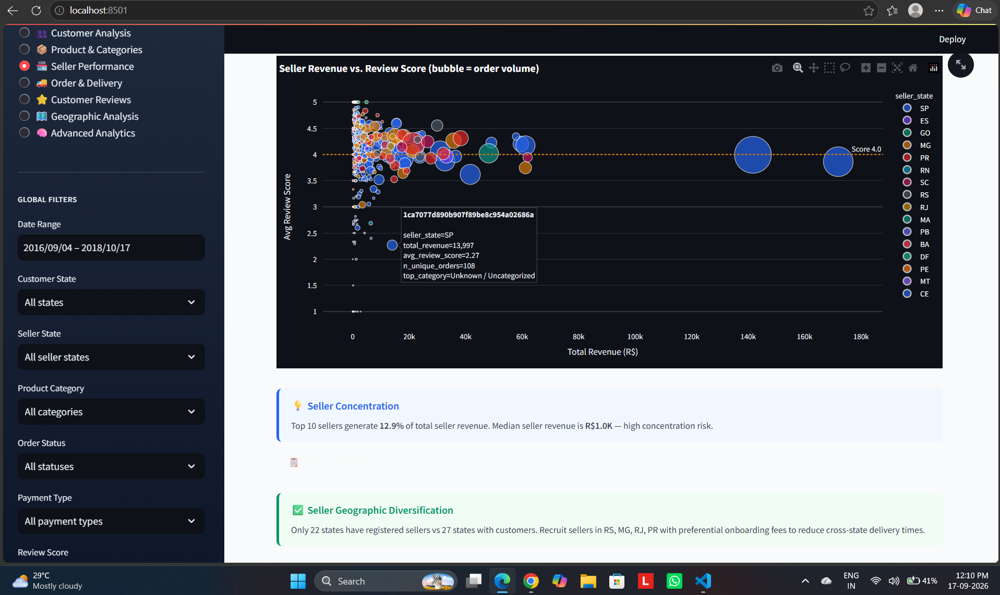
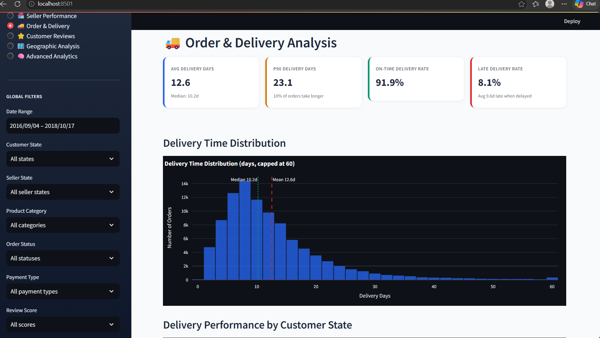
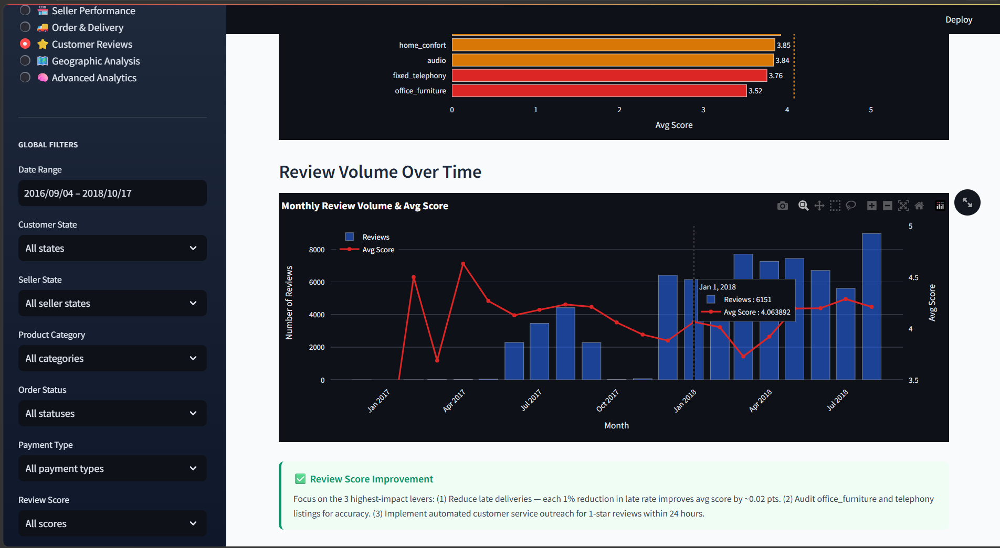
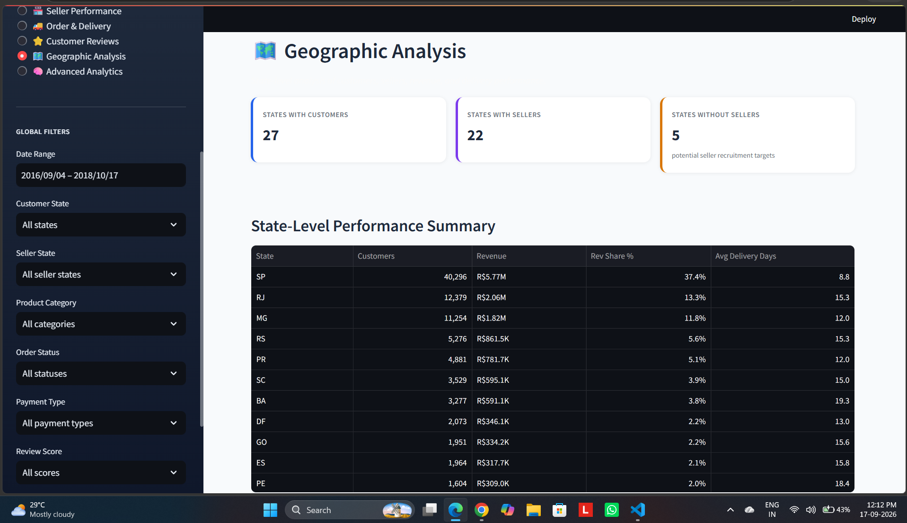
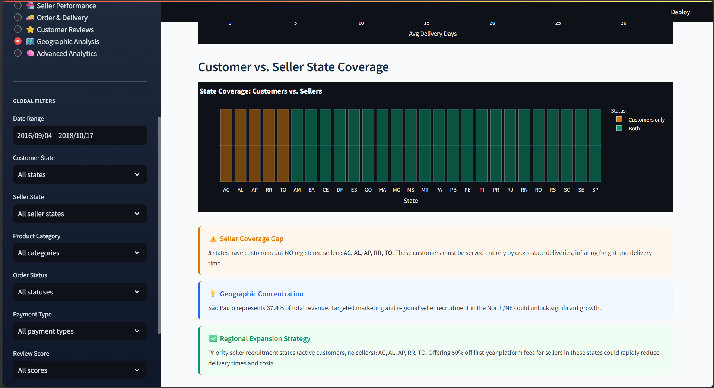
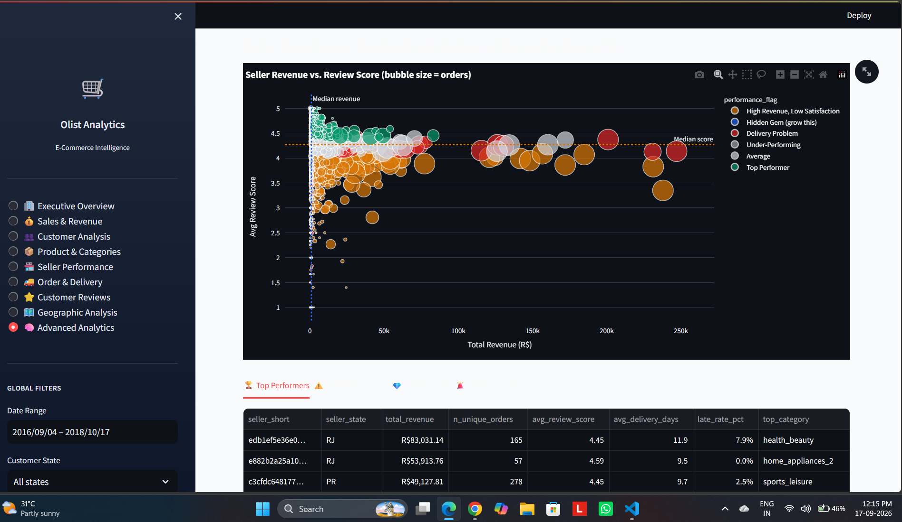

# Olist E-Commerce Business Intelligence & Analytics

> An end-to-end Business Intelligence and Data Analytics project built using real-world Brazilian e-commerce data from Olist.

[](https://www.python.org/)
[](https://pandas.pydata.org/)
[](https://www.sqlite.org/)
[](https://www.sqlite.org/)
[](https://streamlit.io/)
[](https://scikit-learn.org/)
[](https://github.com/)

---

## Table of Contents

- [About the Project](#about-the-project)
- [Business Problem](#business-problem)
- [Key Objectives](#key-objectives)
- [Business Questions](#business-questions)
- [Key Features](#key-features)
- [Technology Stack](#technology-stack)
- [Project Workflow](#project-workflow)
- [Dataset](#dataset)
- [Data Cleaning and Validation](#data-cleaning-and-validation)
- [Exploratory Data Analysis](#exploratory-data-analysis)
- [Advanced Analytics](#advanced-analytics)
- [SQL Analytics and Database](#sql-analytics-and-database)
- [Automated KPI Reporting](#automated-kpi-reporting)
- [Streamlit Dashboard](#streamlit-dashboard)
- [Dashboard Screenshots](#dashboard-screenshots)
- [Verified Business Metrics](#verified-business-metrics)
- [Project Structure](#project-structure)
- [Installation](#installation)
- [How to Run](#how-to-run)
- [Documentation](#documentation)
- [Future Enhancements](#future-enhancements)
- [Project Status](#project-status)
- [Author](#author)
- [License](#license)

---
## About the Project

**Olist E-Commerce Business Intelligence & Analytics** is an end-to-end data analytics project built on the **Brazilian E-Commerce Public Dataset by Olist**.

The project analyzes real e-commerce data across orders, customers, products, sellers, payments, reviews, delivery, and geographic information.

The workflow transforms raw marketplace data into cleaned datasets, analytical outputs, SQL-based business analysis, automated KPIs, and an interactive Streamlit dashboard.

The project demonstrates practical Data Analyst and Business Intelligence skills using Python, SQL, data visualization, statistical analysis, and dashboard development.

---

## Business Problem

E-commerce businesses generate data across multiple operational areas. Analyzing these datasets separately can make it difficult to understand overall business performance.

This project brings the major business data areas together to answer questions such as:

- How are orders and revenue performing?
- Which product categories generate the most revenue?
- How do customers behave and how often do they return?
- Which sellers show different performance patterns?
- How does delivery performance vary?
- What do customer reviews indicate about satisfaction?
- Which geographic regions contribute to marketplace activity?
- Which KPIs should be monitored regularly?

The objective is to convert raw transactional data into structured and actionable business intelligence.

---

## Key Objectives

- Analyze real-world e-commerce transaction data
- Perform systematic data quality checks
- Clean and prepare datasets for analysis
- Identify important business trends and patterns
- Analyze customers, products, sellers, and operations
- Build customer and seller intelligence
- Create reusable SQL analytics
- Build an analytical SQLite database
- Generate automated business KPIs and insights
- Develop an interactive Streamlit dashboard
- Present findings through clear business visualizations

---
## Business Questions

The project focuses on practical business questions across sales, customers, products, sellers, operations, and geography.

1. What is the overall order and revenue performance?
2. How does revenue change over time?
3. Which product categories contribute the most revenue?
4. What is the Average Order Value?
5. How many customers make repeat purchases?
6. What customer segments can be identified from purchase behavior?
7. How does seller performance vary?
8. How does delivery performance vary across orders and regions?
9. Which payment methods are used by customers?
10. How are customer review scores distributed?
11. Which states contribute significantly to marketplace activity?
12. Which KPIs and trends should be monitored regularly?

---

## Key Features

### Data Analytics
- Dataset auditing and profiling
- Data cleaning and preprocessing
- Data quality validation
- Exploratory Data Analysis
- Business-focused visualizations

### Business Intelligence
- Revenue and order analysis
- Customer behavior analysis
- Product and category analysis
- Seller performance analysis
- Delivery performance analysis
- Customer review analysis
- Geographic analysis

### Advanced Analytics
- RFM customer segmentation
- Repeat customer analysis
- Cohort analysis
- Customer retention analysis
- Seller intelligence
- Growth analytics
- Business opportunity analysis

### Data Engineering and SQL
- SQLite analytical database
- Dimension and fact tables
- 18 analytical SQL queries
- Revenue reconciliation
- Data integrity validation

### Reporting and Dashboard
- Automated KPI generation
- Automated business insights
- Markdown KPI report
- Interactive Streamlit dashboard
- Global dashboard filters
- Dashboard screenshots for all major pages

---

## Technology Stack

| Category | Technologies |
|---|---|
| Programming | Python |
| Data Analysis | Pandas, NumPy |
| Visualization | Plotly, Matplotlib |
| Machine Learning | Scikit-learn |
| Database | SQLite |
| Query Language | SQL |
| Dashboard | Streamlit |
| Notebook | Jupyter Notebook |
| Development | VS Code |
| Version Control | Git, GitHub |
| Dataset | Olist Brazilian E-Commerce Dataset |

---

## Project Workflow

The project follows an eight-phase analytics workflow, from raw data inspection to an interactive Business Intelligence dashboard.

### Phase 1 — Dataset Audit

- Inspected all Olist source datasets
- Reviewed columns, data types, and row counts
- Checked missing values and data quality
- Studied relationships between datasets
- Documented the initial data structure

### Phase 2 — Data Cleaning and Preparation

- Standardized datasets and column formats
- Converted date fields to appropriate datatypes
- Handled missing and inconsistent values
- Checked duplicate records
- Created cleaned and enriched datasets
- Validated relationships between major tables

### Phase 3 — Exploratory Data Analysis

Analyzed:

- Orders and revenue
- Monthly performance
- Products and categories
- Customer activity
- Seller activity
- Delivery performance
- Customer reviews
- Payment behavior
- Geographic distribution

### Phase 4 — Streamlit Dashboard

Built an interactive dashboard with nine analysis pages:

- Executive Overview
- Sales & Revenue
- Customer Analysis
- Product & Categories
- Seller Performance
- Order & Delivery
- Customer Reviews
- Geographic Analysis
- Advanced Analytics

### Phase 5 — Advanced Analytics

Implemented:

- RFM customer segmentation
- Repeat customer analysis
- Cohort analysis
- Customer retention analysis
- Seller intelligence
- Growth analytics
- Business opportunity analysis

### Phase 6 — SQL Analytics and Database

Created a SQLite analytical database containing source, dimension, and fact tables.

Implemented **18 analytical SQL queries** covering revenue, customers, products, sellers, delivery, payments, geography, and quarterly performance.

### Phase 7 — Automated KPI Reporting

Built an automated reporting layer for:

- Executive KPIs
- Monthly performance
- Category performance
- State performance
- Payment analysis
- Business insights
- Markdown business reporting

### Phase 8 — Dashboard Integration

Integrated the analytical outputs into the Streamlit application with:

- Business KPIs
- Interactive filters
- Charts and tables
- Customer intelligence
- Seller intelligence
- Delivery analysis
- Geographic analysis
- Advanced analytics

---

## Dataset

This project uses the **Brazilian E-Commerce Public Dataset by Olist**, a real-world anonymized marketplace dataset containing approximately **100K orders** from Brazil.

### Dataset Components

The dataset includes:

- Customers
- Orders
- Order items
- Payments
- Reviews
- Products
- Sellers
- Geolocation
- Product category translations

### Source Files

```text
olist_customers_dataset.csv
olist_geolocation_dataset.csv
olist_order_items_dataset.csv
olist_order_payments_dataset.csv
olist_order_reviews_dataset.csv
olist_orders_dataset.csv
olist_products_dataset.csv
olist_sellers_dataset.csv
product_category_name_translation.csv
---
## Data Cleaning and Validation

The data preparation process keeps the original Olist data separate and creates cleaned datasets for analysis.

### Cleaning Activities

- Inspected dataset structure and datatypes
- Standardized relevant columns
- Converted date columns to datetime format
- Analyzed missing values
- Checked duplicate records
- Validated relationships between datasets
- Created cleaned datasets
- Created enriched analytical datasets

### Validation Checks

The project validates:

- Row counts
- Primary-key uniqueness
- Foreign-key relationships
- Orphan records
- Revenue reconciliation
- Payment reconciliation
- Customer analytics consistency
- Delivery metrics
- SQL query execution

### Phase 6 Validation Result

The analytical database validation completed with:

**54 PASS | 0 FAIL**

Core analytical facts were also reconciled successfully:

```text
fact_orders revenue = R$15,419,773.75
fact_sales revenue  = R$15,419,773.75
difference           = R$0.00
---
## Advanced Analytics

The project extends traditional EDA with customer, seller, retention, and growth analytics.

### Customer Intelligence

Implemented:

- RFM customer segmentation
- Recency analysis
- Frequency analysis
- Monetary analysis
- Repeat customer analysis
- Customer retention analysis
- Cohort analysis

The RFM analysis identifies customer groups based on purchasing behavior, including:

- New Customers
- Hibernating
- Lost
- Promising
- Potential Loyalists
- Need Attention
- At Risk
- Champions

### Seller Intelligence

Seller analytics evaluates different seller performance patterns using:

- Revenue
- Order activity
- Customer satisfaction
- Delivery performance
- Seller-level business metrics

Additional analytical groups include seller performance patterns such as high-revenue/low-satisfaction sellers, hidden opportunities, delivery problems, and under-performing sellers.

### Growth Analytics

Growth analysis covers:

- Monthly revenue trends
- Monthly order trends
- Category performance
- State-level performance
- Growth opportunities
- Business opportunity identification

### Advanced Analytics Outputs

Main Phase 5 analytical modules:

```text
src/
├── rfm_analysis.py
├── cohort_analysis.py
├── seller_intelligence.py
├── growth_analytics.py
├── dashboard_utils.py
└── pages/
    └── advanced_analytics.py

---
## Automated KPI Reporting

Phase 7 adds an automated Business Intelligence reporting layer on top of the analytical database.

### KPI Engine

The KPI engine generates reusable business metrics for:

- Executive performance
- Monthly performance
- Category performance
- State performance
- Payment analysis

Main file:

```text
src/phase7_kpi_engine.py
---
## Dashboard Screenshots

The following screenshots were captured from the working Streamlit dashboard using the actual Olist dataset.

### Executive Overview

Provides a high-level view of marketplace performance through KPIs, revenue trends, order activity, and operational metrics.




---

### Sales & Revenue

Provides revenue trends, order performance, Average Order Value, and sales-related business analysis.




---

### Customer Analysis

Analyzes customer activity, customer distribution, repeat purchasing behavior, and customer-level insights.


---

### Product & Categories

Provides product and category-level analysis including order volume, item activity, and revenue contribution.




---

### Seller Performance

Analyzes seller activity and performance using revenue, orders, customer satisfaction, and operational metrics.






---

### Order & Delivery

Provides order-status analysis and delivery performance metrics.




---

### Customer Reviews

Analyzes customer review scores and review-related marketplace patterns.




---

### Geographic Analysis

Provides state-level and geographic analysis of marketplace activity.





---

### Advanced Analytics

Combines customer intelligence, seller intelligence, growth analytics, and other advanced business analysis.





---

> **Note:** All screenshots above were captured from the project dashboard using the real Olist dataset. No synthetic or mock business data was used.
---
## Verified Business Metrics

The following metrics were validated against the analytical database and project validation checks.

| Metric | Verified Value |
|---|---:|
| Total Orders | 99,441 |
| Delivered Orders | 96,478 |
| Total Revenue | R$15,419,773.75 |
| Average Order Value | R$159.83 |
| Average Delivery Time | 12.56 days |
| Delayed Orders | 7,826 |
| Delayed Order Rate | 8.11% |
| Customers in Delivered-Order Analysis | 93,358 |
| Repeat Customers | 2,801 |
| Repeat Customer Rate | 3.00% |
| SQL Analytical Queries | 18 |
| Database Tables | 17 |
| Phase 6 Validation | 54 PASS / 0 FAIL |

### Revenue Validation

Revenue was reconciled between the two analytical fact tables:

```text
fact_orders = R$15,419,773.75
fact_sales  = R$15,419,773.75
Difference  = R$0.00
---
## Installation

Follow the steps below to run the project locally.

### 1. Clone the Repository

```bash
git clone https://github.com/Himanshu-gudiyan/olist-ecommerce-business-intelligence.git
cd olist-ecommerce-business-intelligence

## Documentation

Project documentation is available in the `docs/` directory.

| Document | Description |
|---|---|
| `data_dictionary.md` | Dataset columns and field descriptions |
| `data_quality_report.md` | Data quality and validation findings |
| `data_model.md` | Analytical data model and relationships |
| `business_questions.md` | Business questions addressed by the project |
| `metric_definitions.md` | Definitions of important business metrics |
| `data_cleaning_report.md` | Data cleaning and preparation details |
| `eda_report.md` | Exploratory Data Analysis findings |

### Additional Resources

```text
notebooks/01_eda.ipynb
sql/analytical_queries.sql
outputs/eda_results.json
outputs/phase7/
